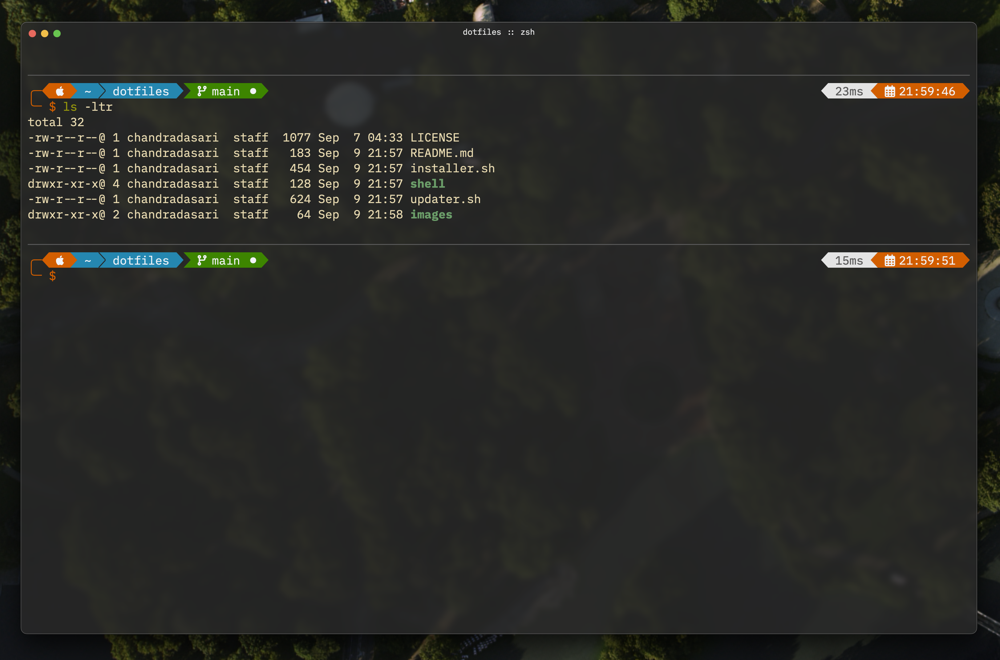
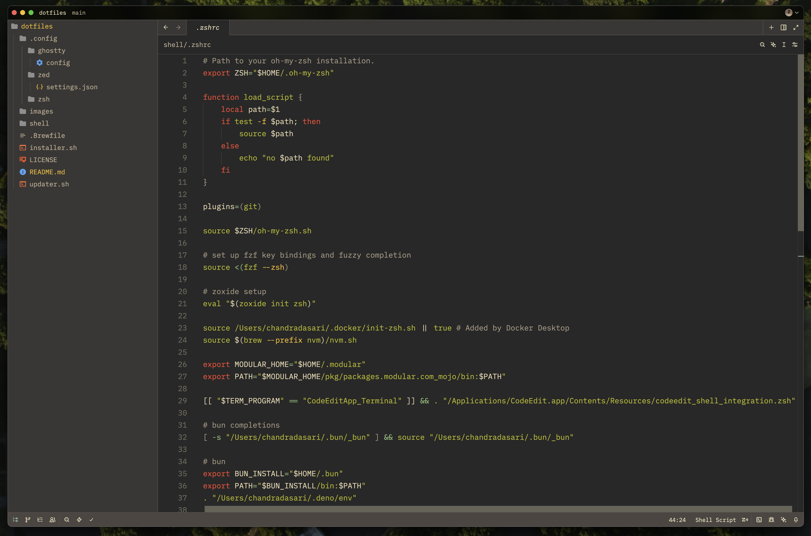

# Dotfiles

Install and setup all configs from this repo to local machine
```bash
./installer.sh
```

Update this repo with latest configs from local machine
```bash
./updater.sh
```

## Terminal
Ghostty + ohmyzsh + ohmyposh



## Editor
Zed + Gruvbox



